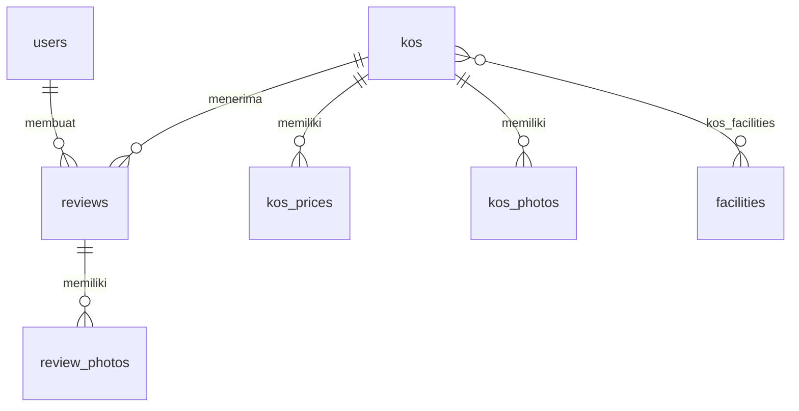

# Design Document — Adakamar.id Platform

## Overview

Adakamar.id adalah platform iklan properti kos berbasis web untuk area Yogyakarta. Platform dibangun dengan arsitektur tiga lapis **Controller → Service → Repository** di atas stack Laravel 12 + React 19 + Inertia.js, tanpa REST API terpisah. Seluruh komunikasi client-server dilakukan melalui Inertia protocol — server merender halaman React lewat `Inertia::render()` dan client melakukan navigasi serta form submission melalui Inertia router.

Platform dibagi menjadi dua sisi:
- **Sisi Publik (Guest)**: browsing listing, pencarian/filter, halaman detail kos, ulasan.
- **Sisi Admin**: dashboard, manajemen kos, fasilitas, ulasan, user, dan pengaturan platform.

Tidak ada fitur booking atau pembayaran online. Calon penyewa menghubungi pemilik kos langsung via WhatsApp.

---

## Architecture

### Stack Teknologi

| Layer | Teknologi |
|---|---|
| Backend | Laravel 12, PHP 8.3+ |
| Frontend | React 19, Inertia.js v3 |
| Styling (Admin) | Flowbite (Tailwind-based component library) |
| Styling (Publik) | Tailwind CSS v4 custom |
| Komponen Utilitas | shadcn/ui (dialog, dropdown, tabs, sheet, form) |
| Build Tool | Vite 7 + @vitejs/plugin-react |
| Database | MySQL |
| Routing (FE) | Ziggy (`route()` helper di React) |
| Auth OAuth | Laravel Socialite (Google) |
| File Storage | Laravel Storage (local disk) |

### Pola Arsitektur: Controller → Service → Repository

```
HTTP Request
    │
    ▼
┌─────────────────────────┐
│       Middleware         │  auth, admin, EnsureAccountIsActive
└──────────┬──────────────┘
           │
    ▼
┌─────────────────────────┐
│    Form Request          │  validasi input (server-side)
└──────────┬──────────────┘
           │
    ▼
┌─────────────────────────┐
│      Controller          │  terima request, kembalikan Inertia::render() / redirect()
└──────────┬──────────────┘
           │
    ▼
┌─────────────────────────┐
│       Service            │  logika bisnis, orchestrasi
└──────────┬──────────────┘
           │
    ▼
┌─────────────────────────┐
│      Repository          │  Eloquent query, tidak ada logika bisnis
└──────────┬──────────────┘
           │
    ▼
┌─────────────────────────┐
│    Model (Eloquent)      │  relasi, scopes, casts, helpers
└─────────────────────────┘
```

**Aturan layer:**
- Controller tidak boleh memanggil Eloquent model langsung (kecuali `Auth::` facade).
- Service tidak boleh memanggil `Inertia::render()` atau `redirect()`.
- Repository hanya berisi query Eloquent, tidak ada logika bisnis (kondisi if, kalkulasi, dll).
- Form Request menangani semua validasi sebelum data masuk ke Controller.

### Data Flow Inertia

```
Laravel (Server)                              React (Client)
─────────────────                             ──────────────
Controller                                    Page Component
  Inertia::render('Page/Name', [              usePage().props
    'data' => $payload,           ──────►       { data, auth, flash }
  ])                                          
                                              
  ◄──── Inertia.visit('/route') ─────         router.get / router.post
  ◄──── useForm().post('/route') ─────        Inertia form submission
```

**Shared props** (dikirim ke semua halaman via `HandleInertiaRequests`):
```php
'auth'    => ['user' => { id, name, email, role, avatar }]
'appName' => Setting::get('platform_name')
'flash'   => ['success' => ..., 'error' => ...]
```

---

## Components and Interfaces

### Struktur Folder Backend (Lengkap)

```
app/
├── Http/
│   ├── Controllers/
│   │   ├── Admin/
│   │   │   ├── AuthController.php          ← login/logout admin ✅ (selesai)
│   │   │   ├── DashboardController.php
│   │   │   ├── KosController.php
│   │   │   ├── FacilityController.php
│   │   │   ├── ReviewController.php
│   │   │   ├── UserController.php
│   │   │   └── SettingController.php
│   │   ├── Guest/
│   │   │   ├── AuthController.php
│   │   │   ├── HomeController.php
│   │   │   ├── KosController.php
│   │   │   └── ReviewController.php
│   │   └── Controller.php
│   ├── Middleware/
│   │   ├── EnsureUserIsAdmin.php           ✅
│   │   ├── EnsureAccountIsActive.php       ✅
│   │   └── HandleInertiaRequests.php       ✅
│   └── Requests/
│       ├── Admin/
│       │   ├── LoginRequest.php            ✅
│       │   ├── StoreKosRequest.php
│       │   ├── UpdateKosRequest.php
│       │   ├── StoreKosPhotoRequest.php
│       │   ├── StoreKosPriceRequest.php
│       │   ├── StoreFacilityRequest.php
│       │   ├── UpdateFacilityRequest.php
│       │   ├── StoreAdminUserRequest.php
│       │   ├── UpdateAdminUserRequest.php
│       │   └── UpdateSettingRequest.php
│       └── Guest/
│           ├── RegisterRequest.php
│           ├── LoginRequest.php
│           └── StoreReviewRequest.php
├── Models/
│   ├── User.php        ✅
│   ├── Kos.php         ✅
│   ├── KosPrice.php    ✅
│   ├── KosPhoto.php    ✅
│   ├── Facility.php    ✅
│   ├── Review.php      ✅
│   ├── ReviewPhoto.php ✅
│   └── Setting.php     ✅
├── Services/
│   ├── Admin/
│   │   ├── KosService.php
│   │   ├── FacilityService.php
│   │   ├── ReviewService.php
│   │   ├── UserService.php
│   │   └── SettingService.php
│   └── Guest/
│       ├── KosService.php
│       └── ReviewService.php
└── Repositories/
    ├── KosRepository.php
    ├── KosPriceRepository.php
    ├── KosPhotoRepository.php
    ├── FacilityRepository.php
    ├── ReviewRepository.php
    ├── UserRepository.php
    └── SettingRepository.php
```

### Struktur Folder Frontend (Lengkap)

```
resources/js/
├── app.jsx                              ✅
├── bootstrap.js                         ✅
├── Layouts/
│   ├── AdminLayout.jsx                  ✅
│   └── GuestLayout.jsx                  ✅
├── Pages/
│   ├── Admin/
│   │   ├── Login.jsx                    ✅
│   │   ├── Dashboard.jsx                ✅
│   │   ├── Kos/
│   │   │   ├── Index.jsx               ← daftar semua kos
│   │   │   ├── Create.jsx              ← form tambah kos
│   │   │   └── Edit.jsx                ← form edit kos (termasuk foto, harga, fasilitas)
│   │   ├── Facilities/
│   │   │   └── Index.jsx               ← CRUD master fasilitas (inline / modal)
│   │   ├── Reviews/
│   │   │   └── Index.jsx               ← daftar + hapus ulasan
│   │   ├── Users/
│   │   │   └── Index.jsx               ← daftar admin & guest, tambah admin, toggle status
│   │   ├── Statistics/
│   │   │   └── Index.jsx               ← statistik platform
│   │   └── Settings/
│   │       └── Index.jsx               ← nama platform + logo
│   └── Guest/
│       ├── Home.jsx                    ← landing page
│       ├── Kos/
│       │   ├── Index.jsx               ← halaman listing + filter
│       │   └── Show.jsx                ← halaman detail kos
│       ├── Auth/
│       │   ├── Login.jsx
│       │   └── Register.jsx
│       └── Error/
│           └── NotFound.jsx
├── Components/
│   ├── Admin/
│   │   ├── KosForm.jsx                 ← shared form antara Create/Edit
│   │   ├── PhotoManager.jsx            ← upload, reorder, set primary foto kos
│   │   ├── PriceManager.jsx            ← toggle & input harga sewa
│   │   ├── FacilitySelector.jsx        ← checkbox fasilitas per kategori
│   │   └── ConfirmDeleteDialog.jsx     ← dialog konfirmasi hapus (shadcn/ui)
│   ├── Guest/
│   │   ├── KosCard.jsx                 ← kartu kos di listing
│   │   ├── SearchBar.jsx               ← search bar hero
│   │   ├── FilterPanel.jsx             ← panel filter di halaman listing
│   │   ├── ReviewForm.jsx              ← form kirim ulasan
│   │   ├── ReviewItem.jsx              ← tampilan satu ulasan
│   │   └── StarRating.jsx              ← komponen rating bintang
│   └── Shared/
│       ├── Pagination.jsx              ← komponen paginasi
│       ├── FlashMessage.jsx            ← notifikasi flash (sukses/error)
│       ├── LoadingSpinner.jsx          ← indikator loading
│       └── ImageWithFallback.jsx       ← gambar dengan fallback placeholder
```

---

## Data Models

### Skema Database dan Relasi Model

```
users
├── id (PK)
├── name (varchar 255)
├── email (varchar 254, unique)
├── password (hashed)
├── role (enum: admin, guest)
├── google_id (varchar, nullable)
├── avatar (varchar, nullable)
├── is_active (boolean, default: true)
├── created_at, updated_at

kos
├── id (PK)
├── name (varchar 150)
├── slug (varchar, unique)
├── description (text, nullable)
├── rules (text, nullable)
├── type (enum: putra, putri, campur)
├── has_ac (boolean)
├── has_wifi (boolean)
├── has_private_bathroom (boolean)
├── district (varchar)                    ← kecamatan
├── address (text)
├── latitude (decimal 10,7, nullable)
├── longitude (decimal 10,7, nullable)
├── contact_name (varchar)
├── contact_whatsapp (varchar 13)
├── is_plus (boolean, default: false)
├── is_active (boolean, default: true)
├── rating_avg (decimal 5,2, default: 0)
├── review_count (integer, default: 0)
├── views_count (integer, default: 0)
├── created_at, updated_at

kos_prices
├── id (PK)
├── kos_id (FK → kos)
├── type (enum: harian, bulanan, tahunan)
├── price (decimal 12,2)
├── is_active (boolean)

kos_photos
├── id (PK)
├── kos_id (FK → kos)
├── path (varchar)
├── is_primary (boolean, default: false)
├── sort_order (integer)

facilities
├── id (PK)
├── name (varchar 100, unique)
├── category (enum: kamar, bersama, sekitar)
├── created_at, updated_at

kos_facilities (pivot)
├── kos_id (FK → kos)
├── facility_id (FK → facilities)

reviews
├── id (PK)
├── kos_id (FK → kos)
├── user_id (FK → users)
├── rating (integer, 1–5)
├── comment (text, nullable)
├── created_at

review_photos
├── id (PK)
├── review_id (FK → reviews)
├── path (varchar)

settings
├── key (PK, varchar)
├── value (text)
├── updated_at
```

### Diagram Relasi Antar Model



---

## Desain Routing (web.php)

```php
// ── Publik ────────────────────────────────────────────────────
Route::get('/', [Guest\HomeController::class, 'index'])->name('home');
Route::get('/kos', [Guest\KosController::class, 'index'])->name('kos.index');
Route::get('/kos/{kos:slug}', [Guest\KosController::class, 'show'])->name('kos.show');

// ── Guest Auth ────────────────────────────────────────────────
Route::middleware('guest')->prefix('')->name('guest.')->group(function () {
    Route::get('/login', [Guest\AuthController::class, 'showLogin'])->name('login');
    Route::post('/login', [Guest\AuthController::class, 'login'])->name('login.post');
    Route::get('/register', [Guest\AuthController::class, 'showRegister'])->name('register');
    Route::post('/register', [Guest\AuthController::class, 'register'])->name('register.post');
    Route::get('/auth/google', [Guest\AuthController::class, 'redirectToGoogle'])->name('auth.google');
    Route::get('/auth/google/callback', [Guest\AuthController::class, 'handleGoogleCallback'])->name('auth.google.callback');
});
Route::post('/logout', [Guest\AuthController::class, 'logout'])->name('guest.logout')->middleware('auth');

// ── Guest Protected ───────────────────────────────────────────
Route::middleware(['auth'])->group(function () {
    Route::post('/kos/{kos:slug}/reviews', [Guest\ReviewController::class, 'store'])->name('reviews.store');
});

// ── Admin Auth ────────────────────────────────────────────────
Route::prefix('admin')->name('admin.')->group(function () {
    Route::get('/login', [Admin\AuthController::class, 'showLogin'])->name('login');        // ✅
    Route::post('/login', [Admin\AuthController::class, 'login'])->name('login.post');      // ✅
    Route::post('/logout', [Admin\AuthController::class, 'logout'])->name('logout');        // ✅
});

// ── Admin Protected ───────────────────────────────────────────
Route::prefix('admin')->name('admin.')->middleware(['auth', 'admin'])->group(function () {
    // Dashboard
    Route::get('/dashboard', [Admin\DashboardController::class, 'index'])->name('dashboard');

    // Kos CRUD
    Route::get('/kos', [Admin\KosController::class, 'index'])->name('kos.index');
    Route::get('/kos/create', [Admin\KosController::class, 'create'])->name('kos.create');
    Route::post('/kos', [Admin\KosController::class, 'store'])->name('kos.store');
    Route::get('/kos/{kos}/edit', [Admin\KosController::class, 'edit'])->name('kos.edit');
    Route::put('/kos/{kos}', [Admin\KosController::class, 'update'])->name('kos.update');
    Route::delete('/kos/{kos}', [Admin\KosController::class, 'destroy'])->name('kos.destroy');
    Route::patch('/kos/{kos}/toggle-active', [Admin\KosController::class, 'toggleActive'])->name('kos.toggleActive');
    Route::patch('/kos/{kos}/toggle-plus', [Admin\KosController::class, 'togglePlus'])->name('kos.togglePlus');

    // Foto Kos
    Route::post('/kos/{kos}/photos', [Admin\KosController::class, 'storePhoto'])->name('kos.photos.store');
    Route::patch('/kos/{kos}/photos/{photo}/primary', [Admin\KosController::class, 'setPrimaryPhoto'])->name('kos.photos.setPrimary');
    Route::delete('/kos/{kos}/photos/{photo}', [Admin\KosController::class, 'destroyPhoto'])->name('kos.photos.destroy');

    // Harga Sewa
    Route::put('/kos/{kos}/prices', [Admin\KosController::class, 'updatePrices'])->name('kos.prices.update');

    // Fasilitas Kos (relasi)
    Route::put('/kos/{kos}/facilities', [Admin\KosController::class, 'updateFacilities'])->name('kos.facilities.update');

    // Master Fasilitas
    Route::get('/facilities', [Admin\FacilityController::class, 'index'])->name('facilities.index');
    Route::post('/facilities', [Admin\FacilityController::class, 'store'])->name('facilities.store');
    Route::put('/facilities/{facility}', [Admin\FacilityController::class, 'update'])->name('facilities.update');
    Route::delete('/facilities/{facility}', [Admin\FacilityController::class, 'destroy'])->name('facilities.destroy');

    // Ulasan
    Route::get('/reviews', [Admin\ReviewController::class, 'index'])->name('reviews.index');
    Route::delete('/reviews/{review}', [Admin\ReviewController::class, 'destroy'])->name('reviews.destroy');

    // User
    Route::get('/users', [Admin\UserController::class, 'index'])->name('users.index');
    Route::post('/users/admin', [Admin\UserController::class, 'storeAdmin'])->name('users.storeAdmin');
    Route::put('/users/{user}', [Admin\UserController::class, 'update'])->name('users.update');
    Route::patch('/users/{user}/toggle-active', [Admin\UserController::class, 'toggleActive'])->name('users.toggleActive');

    // Pengaturan
    Route::get('/settings', [Admin\SettingController::class, 'index'])->name('settings.index');
    Route::put('/settings', [Admin\SettingController::class, 'update'])->name('settings.update');

    // Statistik
    Route::get('/statistics', [Admin\StatisticsController::class, 'index'])->name('statistics.index');
});
```

---

## Desain Service dan Repository

### Repository Layer

Semua repository hanya berisi Eloquent query. Tidak ada logika bisnis.

#### `KosRepository`
```php
interface KosRepository {
    public function all(array $filters = []): LengthAwarePaginator;
    public function findBySlug(string $slug): ?Kos;
    public function findById(int $id): ?Kos;
    public function create(array $data): Kos;
    public function update(Kos $kos, array $data): bool;
    public function delete(Kos $kos): bool;
    public function getActiveForHomepage(): Collection;         // is_active=1, is_plus first, limit 8
    public function getSimilarByDistrict(Kos $kos, int $limit): Collection;
    public function getAdminList(): Collection;
    public function incrementViews(Kos $kos): void;
    public function updateRating(Kos $kos): void;              // hitung ulang rating_avg & review_count
}
```

**Filter yang didukung `all()`:**
```php
$filters = [
    'search'   => string,      // pencarian nama/alamat
    'type'     => string,      // putra|putri|campur
    'district' => string,      // kecamatan
    'price_type' => string,    // harian|bulanan|tahunan
    'price_min' => int,
    'price_max' => int,
]
```

#### `KosPriceRepository`
```php
interface KosPriceRepository {
    public function upsertForKos(Kos $kos, array $prices): void;
    // prices = [['type'=>'harian','price'=>150000,'is_active'=>true], ...]
}
```

#### `KosPhotoRepository`
```php
interface KosPhotoRepository {
    public function store(Kos $kos, string $path, int $sortOrder): KosPhoto;
    public function setPrimary(KosPhoto $photo): void;          // unset semua, set 1
    public function delete(KosPhoto $photo): bool;
    public function getNextSortOrder(Kos $kos): int;
    public function countForKos(Kos $kos): int;
}
```

#### `FacilityRepository`
```php
interface FacilityRepository {
    public function allGroupedByCategory(): array;             // ['kamar'=>[...],'bersama'=>[...],'sekitar'=>[...]]
    public function findById(int $id): ?Facility;
    public function create(array $data): Facility;
    public function update(Facility $facility, array $data): bool;
    public function delete(Facility $facility): bool;
    public function existsByName(string $name, ?int $excludeId = null): bool;
}
```

#### `ReviewRepository`
```php
interface ReviewRepository {
    public function allWithRelations(array $filters = []): LengthAwarePaginator;
    public function forKos(Kos $kos): Collection;              // ordered by created_at DESC
    public function create(array $data): Review;
    public function delete(Review $review): bool;
    public function storePhoto(Review $review, string $path): ReviewPhoto;
}
```

#### `UserRepository`
```php
interface UserRepository {
    public function allAdmins(): Collection;
    public function allGuests(): Collection;
    public function findById(int $id): ?User;
    public function create(array $data): User;
    public function update(User $user, array $data): bool;
    public function toggleActive(User $user): bool;
    public function existsByEmail(string $email, ?int $excludeId = null): bool;
    public function findByGoogleId(string $googleId): ?User;
    public function findByEmail(string $email): ?User;
}
```

#### `SettingRepository`
```php
interface SettingRepository {
    public function get(string $key, mixed $default = null): mixed;
    public function set(string $key, mixed $value): void;
    public function getMultiple(array $keys): array;
}
```

---

### Service Layer

Service mengandung logika bisnis dan memanggil repository. Service bisa memanggil service lain.

#### `Admin\KosService`
```php
class KosService {
    public function store(array $data, array $facilityIds, array $prices): Kos;
    public function update(Kos $kos, array $data, array $facilityIds, array $prices): Kos;
    public function delete(Kos $kos): void;           // hapus file foto + record + cascade
    public function toggleActive(Kos $kos): Kos;
    public function togglePlus(Kos $kos): Kos;
    public function uploadPhoto(Kos $kos, UploadedFile $file): KosPhoto;
    public function setPrimaryPhoto(KosPhoto $photo): void;
    public function deletePhoto(KosPhoto $photo): void;
    public function updateFacilities(Kos $kos, array $facilityIds): void;  // sync pivot
    public function updatePrices(Kos $kos, array $prices): void;
    // Internal: generateUniqueSlug(), validatePhotoCount(), validatePhotoSize()
}
```

#### `Guest\KosService`
```php
class KosService {
    public function getHomepageListing(): Collection;
    public function getFilteredListing(array $filters): LengthAwarePaginator;
    public function getDetailBySlug(string $slug): Kos;        // throw 404 jika tidak ada
    public function getSimilarKos(Kos $kos): Collection;
    public function incrementViews(Kos $kos): void;
}
```

#### `Guest\ReviewService`
```php
class ReviewService {
    public function store(Kos $kos, User $user, array $data, array $files): Review;
    // Internal: uploadPhotos(), validatePhotoCount(), validatePhotoSize()
}
```

#### `Admin\FacilityService`
```php
class FacilityService {
    public function store(array $data): Facility;
    public function update(Facility $facility, array $data): Facility;
    public function delete(Facility $facility): void;
    // Internal: checkNameUnique()
}
```

#### `Admin\ReviewService`
```php
class ReviewService {
    public function delete(Review $review): void;
    // hapus foto dari storage, hapus record, update rating_avg kos
}
```

#### `Admin\UserService`
```php
class UserService {
    public function storeAdmin(array $data): User;
    public function update(User $user, array $data): User;
    public function toggleActive(User $user, User $currentAdmin): void;
    // guard: tidak boleh deaktivasi diri sendiri
}
```

#### `Admin\SettingService`
```php
class SettingService {
    public function update(array $data, ?UploadedFile $logoFile): void;
    // update platform_name, upload logo baru, hapus logo lama
}
```

---

## State Management di React

### Pola Umum

**1. Form submission dengan `useForm` (Inertia)**
```jsx
// Semua form menggunakan useForm dari @inertiajs/react
const { data, setData, post, put, processing, errors, reset } = useForm({
    name: '',
    type: 'putra',
    // ...
});

// Submit
const handleSubmit = (e) => {
    e.preventDefault();
    post(route('admin.kos.store'));
};
```

**2. Toggle/PATCH dengan `router`**
```jsx
import { router } from '@inertiajs/react';

const handleToggleActive = (kos) => {
    router.patch(route('admin.kos.toggleActive', kos.id), {}, {
        preserveScroll: true,
    });
};
```

**3. Filter state di halaman listing publik**
```jsx
// Filter disimpan di URL query params, bukan state lokal
// Ini memungkinkan back navigation mempertahankan filter (Req 4.10)
const [filters, setFilters] = useState({
    search: '',
    type: '',
    district: '',
    price_type: '',
    price_min: '',
    price_max: '',
});

// Saat filter berubah, Inertia.visit dengan preserveState: true
const applyFilters = (newFilters) => {
    router.get(route('kos.index'), newFilters, {
        preserveState: true,
        replace: true,
    });
};
```

**4. State lokal untuk UI saja**
```jsx
// Dialog, modal, accordion — state yang tidak perlu server
const [showDeleteDialog, setShowDeleteDialog] = useState(false);
const [activeTab, setActiveTab] = useState('kamar');
```

### State Management per Halaman

| Halaman | State Approach |
|---|---|
| Admin/Kos/Index | URL params (search), `router.patch` untuk toggle |
| Admin/Kos/Create | `useForm` |
| Admin/Kos/Edit | `useForm` + local state untuk foto/harga |
| Admin/Facilities/Index | `useForm` untuk inline add/edit, local state untuk dialog |
| Guest/Kos/Index | URL query params via `router.get` dengan `preserveState` |
| Guest/Kos/Show | Props dari server, `useForm` untuk review submission |

---

## Komponen UI per Halaman

### Admin (Flowbite + shadcn/ui)

| Komponen | Library | Keterangan |
|---|---|---|
| Sidebar & layout | Flowbite (custom di AdminLayout) | ✅ sudah ada |
| Tabel data | Flowbite table classes | daftar kos, user, ulasan |
| Toggle switch | Flowbite toggle | aktif/plus status |
| Modal/Dialog konfirmasi | shadcn/ui `<Dialog>` | konfirmasi hapus |
| Dropdown | shadcn/ui `<DropdownMenu>` | aksi per row tabel |
| Tab | shadcn/ui `<Tabs>` | edit kos (info/foto/harga/fasilitas) |
| Form input | Flowbite form classes | input teks, select |
| Badge status | Flowbite badge | aktif/nonaktif, Plus |
| Alert flash | Flowbite alert | flash success/error |

### Guest / Publik (Tailwind CSS Custom)

| Komponen | Pendekatan | Keterangan |
|---|---|---|
| Hero section | Tailwind custom | gradient, search bar |
| KosCard | Tailwind custom | kartu listing dengan foto, badge Plus |
| FilterPanel | Tailwind custom + shadcn/ui Slider | panel filter samping/atas |
| StarRating | Tailwind custom (SVG bintang) | input + display rating |
| ReviewForm | Tailwind custom + shadcn/ui | form ulasan dengan file upload |
| Galeri foto | Tailwind custom (lightbox minimal) | galeri detail kos |
| WhatsApp CTA | Tailwind custom | tombol hijau WA |
| Peta embed | iframe Google Maps | koordinat lat/lng |

---

## Desain Komponen per Layer (Per Fitur)

### Phase 2: Master Fasilitas

**Backend:**
- `FacilityController@index` → props: `{ facilities: { kamar: [], bersama: [], sekitar: [] } }`
- `FacilityController@store` → `StoreFacilityRequest` → `FacilityService@store`
- `FacilityController@update` → `UpdateFacilityRequest` → `FacilityService@update`
- `FacilityController@destroy` → `FacilityService@delete`

**Frontend:** `Admin/Facilities/Index.jsx`
- Menampilkan tabel fasilitas dikelompokkan per kategori (3 section/accordion)
- Inline form tambah fasilitas di bawah setiap tabel
- Edit inline dengan row yang berubah menjadi input
- Delete dengan `<ConfirmDeleteDialog>`
- Flowbite table + shadcn/ui Dialog

---

### Phase 3: Manajemen Kos Admin

**Backend:**
- `KosController@index` → props: `{ kos: [...] }` — semua kos dengan info ringkas
- `KosController@create` → props: `{ facilities: [...], districts: [...] }`
- `KosController@store` → `StoreKosRequest` → `KosService@store`
- `KosController@edit` → props: `{ kos, photos, prices, facilities, allFacilities, districts }`
- `KosController@update` → `UpdateKosRequest` → `KosService@update`

Operasi foto, harga, fasilitas dilakukan lewat route terpisah agar edit kos tidak satu form gigantik:
- `PATCH /admin/kos/{kos}/photos/{photo}/primary`
- `DELETE /admin/kos/{kos}/photos/{photo}`
- `POST /admin/kos/{kos}/photos`
- `PUT /admin/kos/{kos}/prices`
- `PUT /admin/kos/{kos}/facilities`

**Frontend:** `Admin/Kos/Edit.jsx` menggunakan `<Tabs>` shadcn/ui:
1. Tab **Info Dasar** — nama, deskripsi, tipe, kecamatan, alamat, kontak, koordinat, peraturan
2. Tab **Foto** — `<PhotoManager>`: upload, set primary, hapus, lihat sort_order
3. Tab **Harga Sewa** — `<PriceManager>`: toggle per tipe + input harga
4. Tab **Fasilitas** — `<FacilitySelector>`: checkbox dikelompokkan per kategori

---

### Phase 4: Landing Page + Listing Publik

**Backend:**
- `HomeController@index` → props: `{ featuredKos: [...], districts: [...] }`
- `KosController@index` → props: `{ kos: LengthAwarePaginator, filters: {...}, districts: [...] }`

Paginasi menggunakan `LengthAwarePaginator` Eloquent, dikirim ke React sebagai objek dengan `data`, `links`, `meta`.

**Frontend:**
- `Guest/Home.jsx` — hero + search bar + quick filter chips + 8 kos card + fitur unggulan
- `Guest/Kos/Index.jsx` — sidebar filter + grid listing + paginasi
- Filter state disimpan di URL params, dipertahankan dengan `preserveState: true`

---

### Phase 5: Halaman Detail Kos

**Backend:**
- `KosController@show` — eager load `photos`, `activePrices`, `facilities`, `reviews.user`, `reviews.photos`
- Increment `views_count` via `Guest\KosService@incrementViews`
- Return props: `{ kos, similarKos }`

**Frontend:** `Guest/Kos/Show.jsx`
- Galeri foto dengan foto utama besar + thumbnail
- Info umum (AC, WiFi, KM dalam) — icon + label
- Harga per tipe — pill/badge per tipe aktif
- Fasilitas 3 kolom per kategori
- Peta embed atau fallback teks
- Kontak + tombol WhatsApp
- Daftar ulasan + form ulasan (jika login)
- Rekomendasi kos serupa (4 kartu)

---

### Phase 6: Autentikasi Guest

**Backend:** `Guest\AuthController`
- `showLogin` / `login` — manual email+password + redirect ke halaman sebelumnya
- `showRegister` / `register` — buat akun dengan role `guest`
- `redirectToGoogle` — `Socialite::driver('google')->redirect()`
- `handleGoogleCallback` — `Socialite::driver('google')->user()` → `UserRepository@findByGoogleId` atau create baru
- `logout` — invalidate session

**Frontend:** `Guest/Auth/Login.jsx`, `Guest/Auth/Register.jsx`
- Tailwind custom form
- Tombol "Login dengan Google" (link ke `/auth/google`)
- Error dari Inertia `errors` prop

---

### Phase 7: Ulasan & Rating

**Backend:** `Guest\ReviewController@store`
- Middleware `auth` (wajib login)
- `StoreReviewRequest` — validasi: rating 1–5, comment maks 1000 char, foto maks 3 × 2MB, format JPEG/PNG
- `ReviewService@store` — simpan review, upload foto, panggil `KosRepository@updateRating`

**Frontend:** `<ReviewForm>` di `Guest/Kos/Show.jsx`
- `useForm` dengan field: rating (StarRating), comment (textarea), photos (file input)
- Tombol submit hanya tampil jika `auth.user` tidak null
- Jika tidak login, tampil tombol "Login untuk memberi ulasan"

---

### Phase 8: Dashboard + Statistik Admin

**Backend:**
- `DashboardController@index` — query: count active kos, count plus kos, count reviews, 5 kos terbaru, 5 ulasan terbaru
- `StatisticsController@index` — query lebih lengkap: per tipe, breakdown

**Frontend:**
- `Admin/Dashboard.jsx` — kartu statistik (3 kartu) + 2 tabel aktivitas terbaru (Flowbite)
- `Admin/Statistics/Index.jsx` — kartu statistik lengkap + charts sederhana (opsional)

---

### Phase 9: Manajemen Ulasan & User Admin

**Backend:**
- `ReviewController@index` — semua ulasan dengan relasi kos + user, paginated
- `ReviewController@destroy` — `ReviewService@delete`: hapus file, hapus record, update rating kos
- `UserController@index` — props: `{ admins: [...], guests: [...] }`
- `UserController@storeAdmin` — buat admin baru
- `UserController@toggleActive` — guard diri sendiri di `UserService`

**Frontend:**
- `Admin/Reviews/Index.jsx` — tabel ulasan dengan konfirmasi hapus
- `Admin/Users/Index.jsx` — dua tab (admin / guest), form inline tambah admin, toggle aktif

---

### Phase 10: Pengaturan Platform

**Backend:**
- `SettingController@index` — props: `{ settings: { platform_name, logo_path } }`
- `SettingController@update` — `UpdateSettingRequest` + `SettingService@update`
- Setting disimpan di tabel `settings` dengan key: `platform_name`, `platform_logo`

**Frontend:** `Admin/Settings/Index.jsx`
- Input nama platform + preview logo saat ini
- File input untuk upload logo baru
- `useForm` dengan `forceFormData: true` untuk upload file

---

## Correctness Properties

*A property is a characteristic or behavior that should hold true across all valid executions of a system — essentially, a formal statement about what the system should do. Properties serve as the bridge between human-readable specifications and machine-verifiable correctness guarantees.*

### Property 1: Rate Limiting Memblokir Setelah 5 Percobaan Gagal

*For any* kombinasi email dan IP address, setelah tepat 5 percobaan login gagal dalam satu window 60 detik, percobaan ke-6 dan seterusnya harus diblokir dengan pesan yang mengindikasikan rate limit, bukan pesan "Email atau password salah".

**Validates: Requirements 1.3**

---

### Property 2: Akun Nonaktif Selalu Ditolak Login

*For any* akun user dengan `is_active = false`, setiap percobaan login — baik dengan email/password yang valid maupun tidak — harus mengembalikan pesan "Akun Anda telah dinonaktifkan" dan tidak menghasilkan sesi aktif.

**Validates: Requirements 13.5, 13.6**

---

### Property 3: Password Selalu Tersimpan Sebagai Hash

*For any* string password yang diberikan oleh user (Admin maupun Guest), nilai yang tersimpan di kolom `password` pada tabel `users` harus berbeda dari plaintext input dan tidak dapat dibalikkan ke nilai aslinya dengan fungsi bawaan.

**Validates: Requirements 1.7**

---

### Property 4: Homepage Listing Selalu Aktif, Terurut Plus-First, Maks 8

*For any* dataset kos dengan kombinasi `is_active` dan `is_plus` yang acak, hasil homepage listing harus: (a) hanya berisi kos dengan `is_active = 1`, (b) semua kos dengan `is_plus = 1` muncul sebelum kos dengan `is_plus = 0`, dan (c) jumlah total tidak melebihi 8.

**Validates: Requirements 3.2**

---

### Property 5: Semua Filter Listing Bersifat Konjungtif (AND)

*For any* kombinasi filter aktif (tipe, district, price_type, price_min, price_max), setiap kos yang dikembalikan di hasil listing harus memenuhi **semua** filter yang aktif secara bersamaan. Tidak ada kos yang lolos filter yang tidak seharusnya.

**Validates: Requirements 4.2, 4.3, 4.4, 4.5, 4.6**

---

### Property 6: Validasi Harga Min Tidak Boleh Melebihi Harga Max

*For any* pasangan nilai (price_min, price_max) di mana price_min > price_max, sistem harus menolak query filter tersebut dan menampilkan pesan validasi, tanpa memperbarui hasil listing.

**Validates: Requirements 4.8**

---

### Property 7: Slug Kos Selalu Unik di Seluruh Dataset

*For any* koleksi kos yang tersimpan di database, tidak boleh ada dua kos yang memiliki nilai `slug` yang sama. Jika dua kos dibuat dengan nama yang identik, sistem harus menghasilkan slug yang berbeda (dengan sufiks numerik).

**Validates: Requirements 8.2**

---

### Property 8: Setiap Kos Memiliki Paling Banyak Satu Foto Utama

*For any* kos dan *for any* operasi "set primary photo", setelah operasi selesai, jumlah foto dengan `is_primary = 1` pada kos tersebut harus selalu tepat 0 atau 1. Operasi set primary harus otomatis menghapus tanda primary dari semua foto lain milik kos yang sama.

**Validates: Requirements 8.5**

---

### Property 9: Foto Kos Ditolak Jika Ukuran > 2MB atau Format Tidak Valid

*For any* file yang diunggah sebagai foto kos, jika ukuran file melebihi 2MB atau format MIME bukan `image/jpeg`, `image/png`, atau `image/webp`, maka upload harus ditolak dengan pesan validasi yang sesuai dan tidak ada file yang tersimpan.

**Validates: Requirements 8.4**

---

### Property 10: Rating Average Selalu Merupakan Rata-Rata Aritmetika

*For any* kumpulan rating ulasan (kumpulan bilangan bulat 1–5) untuk sebuah kos, nilai `rating_avg` yang tersimpan di tabel `kos` harus selalu sama dengan `round(sum(ratings) / count(ratings), 2)`. Invariant ini harus terjaga setiap kali ulasan ditambah atau dihapus.

**Validates: Requirements 6.9**

---

### Property 11: Komentar Ulasan Lebih dari 1000 Karakter Selalu Ditolak

*For any* string komentar dengan panjang lebih dari 1000 karakter, pengiriman form ulasan harus ditolak dengan pesan validasi, dan tidak ada record ulasan yang tersimpan.

**Validates: Requirements 6.5**

---

### Property 12: Foto Ulasan Ditolak Jika Ukuran > 2MB

*For any* file foto yang dilampirkan dalam ulasan dengan ukuran melebihi 2MB, pengiriman form harus ditolak dengan pesan validasi yang sesuai, dan tidak ada ulasan maupun foto yang tersimpan.

**Validates: Requirements 6.7**

---

### Property 13: Slug Tidak Valid atau Kos Nonaktif Selalu Menghasilkan 404

*For any* string slug yang tidak terdaftar di database, atau *for any* kos dengan `is_active = 0` yang diakses via slug-nya, respons HTTP harus selalu 404.

**Validates: Requirements 5.2**

---

### Property 14: Foto Kos Ditampilkan Sesuai Urutan sort_order ASC

*For any* kos dengan koleksi foto yang memiliki nilai `sort_order` acak, urutan foto yang ditampilkan di halaman detail harus selalu mengikuti urutan `sort_order` dari nilai terkecil ke terbesar.

**Validates: Requirements 5.3**

---

### Property 15: Nama Fasilitas Harus Unik di Master Fasilitas

*For any* nama fasilitas yang sudah ada di tabel `facilities`, upaya membuat fasilitas baru dengan nama yang sama (case-insensitive) harus ditolak dengan pesan validasi "Nama fasilitas sudah ada".

**Validates: Requirements 10.5**

---

## Error Handling

### HTTP Errors

| Kondisi | Respons |
|---|---|
| Kos slug tidak ditemukan / nonaktif | 404 — halaman error |
| Akses route admin tanpa sesi | 302 → redirect ke `/admin/login` |
| Akses route admin dengan role guest | 302 → redirect ke `/admin/login` |
| CSRF token tidak valid | 419 — Laravel default |
| Validasi Form Request gagal | 422 — Inertia mengembalikan ke halaman sebelumnya dengan `errors` prop |
| File upload gagal (storage error) | Flash error + data tidak tersimpan |
| Penghapusan file gagal | Flash error + record tetap di DB |

### Pola Error Handling di Service

```php
// Service melempar exception, Controller menangkap dan meneruskan ke Inertia
class KosService {
    public function deletePhoto(KosPhoto $photo): void {
        if (!Storage::delete($photo->path)) {
            throw new \RuntimeException('Foto gagal dihapus, coba lagi');
        }
        $photo->delete();
    }
}

// Controller
try {
    $this->kosService->deletePhoto($photo);
    return back()->with('success', 'Foto berhasil dihapus.');
} catch (\RuntimeException $e) {
    return back()->with('error', $e->getMessage());
}
```

### Flash Messages

Flash messages dikirim melalui session dan dibagikan via `HandleInertiaRequests`:
```php
'flash' => [
    'success' => fn () => $request->session()->get('success'),
    'error'   => fn () => $request->session()->get('error'),
]
```

Ditampilkan oleh komponen `<FlashMessage>` di layout.

---

## Testing Strategy

### Pendekatan Dual Testing

**Unit/Feature Tests (PHPUnit)**:
- Menguji logika Service dan Repository secara terisolasi
- Menguji Controller responses (Inertia page assertions)
- Menguji Form Request validation rules
- Menguji edge cases dan contoh spesifik

**Property-Based Tests (PHPUnit + custom generator atau Eris)**:
- Menguji correctness properties yang teridentifikasi di atas
- Setiap property test dijalankan minimum 100 iterasi
- Menggunakan in-memory SQLite untuk isolasi dan kecepatan
- Tag format: `// Feature: adakamarid-platform, Property {N}: {property_text}`

### Library PBT

Gunakan [Eris](https://github.com/giorgiosironi/eris) untuk PHP property-based testing:
```json
// composer.json (require-dev)
"giorgiosironi/eris": "^0.12"
```

### Contoh Test Skeleton

```php
// Property 10: Rating average selalu merupakan rata-rata aritmetika
// Feature: adakamarid-platform, Property 10: rating_avg == round(avg(ratings), 2)
class KosRatingPropertyTest extends TestCase {
    use ForAll;

    public function testRatingAvgIsArithmeticMean(): void {
        $this->forAll(
            Generator\vector(Generator\choose(1, 5), Generator\choose(1, 10))
        )->then(function (array $ratings) {
            $kos = Kos::factory()->create();
            foreach ($ratings as $rating) {
                Review::factory()->create(['kos_id' => $kos->id, 'rating' => $rating]);
            }
            $kos->recalculateRating();
            $expected = round(array_sum($ratings) / count($ratings), 2);
            $this->assertEquals($expected, (float) $kos->fresh()->rating_avg);
        });
    }
}
```

### Cakupan Test per Fase

| Fase | Unit/Feature Tests | Property Tests |
|---|---|---|
| Auth Admin (Phase 1) | Login, logout, redirect, rate limit, role check | Property 1, 2, 3 |
| Master Fasilitas (Phase 2) | CRUD valid/invalid, nama duplikat | Property 15 |
| Manajemen Kos (Phase 3) | Store/update/delete, foto, harga | Property 7, 8, 9 |
| Listing Publik (Phase 4) | Homepage query, filter query | Property 4, 5, 6 |
| Detail Kos (Phase 5) | Slug lookup, 404 cases, photo order | Property 13, 14 |
| Auth Guest (Phase 6) | Register, login, OAuth callback | Property 3 |
| Ulasan (Phase 7) | Store review, delete, rating recalc | Property 10, 11, 12 |
| User Management (Phase 9) | Toggle active, self-deactivation guard | Property 2 |
