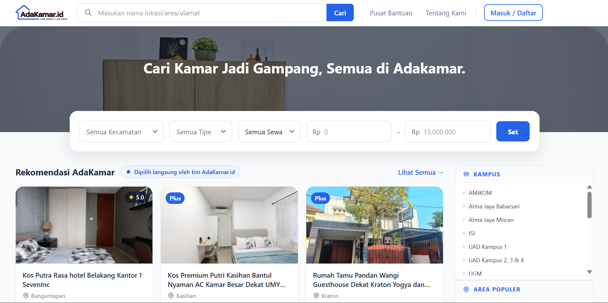
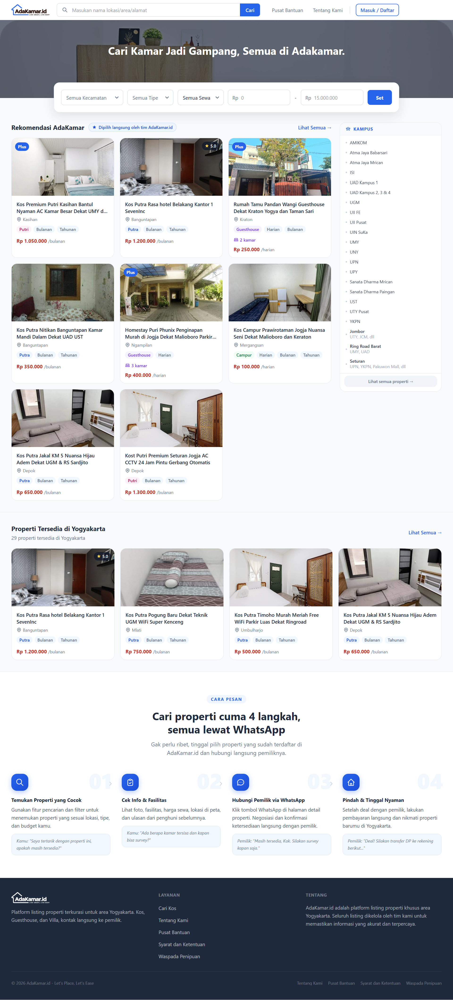
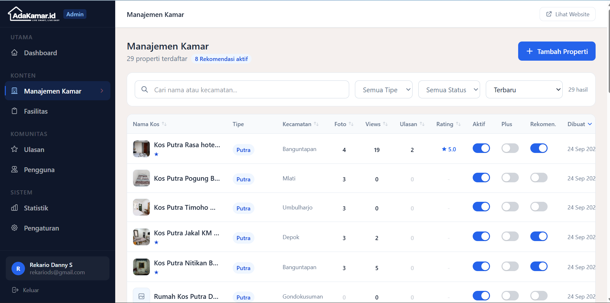

# AdaKamar.id

Platform listing properti sewa terkurasi untuk area Yogyakarta. Kos, Guesthouse, dan Villa - informasi lengkap, hubungi pemilik langsung.

---
## Preview







---

## Tech Stack

| Layer | Teknologi |
|---|---|
| Backend | PHP 8.2, Laravel 12 |
| Frontend | React 19, Inertia.js 3, Tailwind CSS 4 |
| Build Tool | Vite 7 |
| Auth | Laravel Session + Google OAuth (Socialite) |
| Routing FE | Ziggy |
| Database | MySQL |

---

## Persyaratan Sistem

| Tool | Versi Minimum | Cek |
|---|---|---|
| PHP | 8.2 | `php --version` |
| Composer | 2.x | `composer --version` |
| Node.js | 18.x | `node --version` |
| npm | 9.x | `npm --version` |
| MySQL | 8.0 | `mysql --version` |

---

## Instalasi

### 1. Clone repository

```bash
git clone https://github.com/jakwan-magang/Adakamar-project.git
cd adakamar-project
```

### 2. Install dependencies PHP

```bash
composer install
```

### 3. Install dependencies JavaScript

```bash
npm install
```

### 4. Konfigurasi environment

```bash
cp .env.example .env
php artisan key:generate
```

Buka file `.env` dan sesuaikan:

```env
DB_CONNECTION=mysql
DB_HOST=127.0.0.1
DB_PORT=3306
DB_DATABASE=adakamar_db
DB_USERNAME=root
DB_PASSWORD=

GOOGLE_CLIENT_ID=your-client-id
GOOGLE_CLIENT_SECRET=your-client-secret
GOOGLE_REDIRECT_URI=http://localhost:8000/auth/google/callback
```

### 5. Buat database MySQL

```sql
CREATE DATABASE adakamar_db CHARACTER SET utf8mb4 COLLATE utf8mb4_unicode_ci;
```

### 6. Import skema database

Project ini menggunakan file SQL terpisah, bukan Laravel migration.
Import file `.sql` yang disertakan ke database yang sudah dibuat:

```bash
mysql -u root -p adakamar_db < adakamar_db.sql
```

Atau import melalui phpMyAdmin / TablePlus / tools MySQL lainnya.

### 7. Jalankan seeder (opsional)

Untuk mengisi data contoh (akun admin, setting platform):

```bash
php artisan db:seed
```

### 8. Storage symlink

```bash
php artisan storage:link
```

### 9. Jalankan aplikasi

```bash
# Development (hot reload)
npm run dev
php artisan serve

# Production
npm run build
php artisan serve
```

Buka browser di **http://localhost:8000**

---

## Setup Otomatis

Setelah mengisi `.env`, jalankan satu perintah:

```bash
composer run setup
```

Akan menjalankan: `composer install` → key:generate → `npm install` → `npm run build`

> Catatan: import database `.sql` dan `db:seed` tetap harus dijalankan manual.

---

## Akun Default

| Role | Email | Password |
|---|---|---|
| Admin | `admin@adakamar.id` | `password` |

> Ganti password setelah login pertama.

---

## PHP Dependencies (`composer.json`)

### Production
| Package | Versi | Fungsi |
|---|---|---|
| `laravel/framework` | ^12.0 | Core framework |
| `inertiajs/inertia-laravel` | ^3.3 | Server-side adapter Inertia |
| `laravel/socialite` | ^5.31 | OAuth Google Login |
| `tightenco/ziggy` | ^2.6 | Named routes untuk JS |
| `laravel/tinker` | ^2.10 | REPL development |

### Development
| Package | Versi | Fungsi |
|---|---|---|
| `fakerphp/faker` | ^1.23 | Data palsu untuk seeder |
| `laravel/pint` | ^1.24 | PHP code formatter |
| `laravel/sail` | ^1.41 | Docker environment |
| `phpunit/phpunit` | ^11.5 | Testing framework |
| `laravel/pail` | ^1.2 | Log viewer terminal |
| `nunomaduro/collision` | ^8.6 | Error reporting |
| `mockery/mockery` | ^1.6 | Mock library untuk test |

---

## JavaScript Dependencies (`package.json`)

### Production
| Package | Versi | Fungsi |
|---|---|---|
| `react` | ^19.2 | UI library |
| `react-dom` | ^19.2 | React DOM renderer |
| `@inertiajs/react` | ^3.7 | Client-side adapter Inertia |
| `ziggy-js` | ^2.6 | Named route helper di React |
| `flowbite` | ^4.0 | Komponen UI berbasis Tailwind |

### Development
| Package | Versi | Fungsi |
|---|---|---|
| `vite` | ^7.0 | Build tool dan dev server |
| `@vitejs/plugin-react` | ^4.3 | React plugin untuk Vite |
| `laravel-vite-plugin` | ^2.0 | Integrasi Vite dengan Laravel |
| `tailwindcss` | ^4.3 | Utility-first CSS framework |
| `@tailwindcss/vite` | ^4.0 | Tailwind plugin untuk Vite |
| `postcss` | ^8.5 | CSS processor |
| `autoprefixer` | ^10.5 | Auto vendor prefix CSS |
| `axios` | ^1.11 | HTTP client |
| `concurrently` | ^9.0 | Jalankan beberapa proses paralel |

---

## Struktur Direktori

```
adakamarid-project/
├── app/
│   ├── Http/Controllers/
│   │   ├── Admin/       # Controller panel admin
│   │   └── Guest/       # Controller halaman publik
│   ├── Models/          # Eloquent models
│   ├── Repositories/    # Query layer
│   └── Services/        # Business logic
├── database/
│   ├── migrations/      # Skema database
│   └── seeders/         # Data awal
├── resources/js/
│   ├── Components/      # Komponen React reusable
│   ├── Layouts/         # GuestLayout, AdminLayout
│   └── Pages/           # Halaman Admin/ dan Guest/
├── routes/web.php       # Semua route
└── public/storage       # Symlink ke storage/app/public
```

---

## Troubleshooting

**Gambar tidak muncul setelah clone atau pindah folder:**
```bash
php artisan storage:link
```

**Error `Class not found` setelah pull:**
```bash
composer dump-autoload
```

**Perubahan frontend tidak terefleksi:**
```bash
npm run build
```

**Cache bermasalah:**
```bash
php artisan optimize:clear
```
